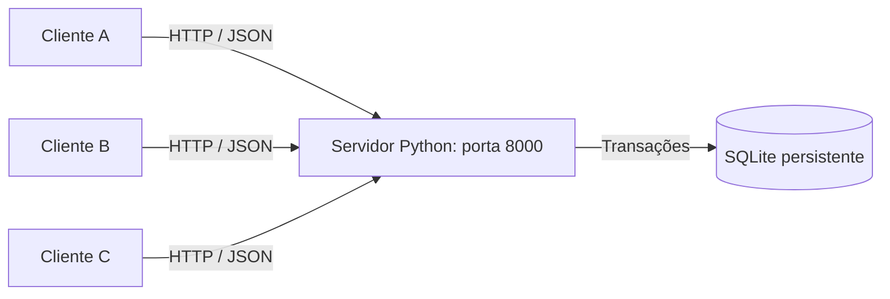

# Venda distribuída de ingressos

Atividade de **Sistemas Distribuídos e Computação em Nuvem**: sistema
cliente-servidor para venda de ingressos de um evento com **50 assentos**.
Vários clientes podem comprar ao mesmo tempo, sem assento duplicado nem estoque
negativo. O assento é atribuído automaticamente, em ordem crescente.

## Arquitetura



O cliente é um programa separado. Ele não abre o banco: envia requisições pela
rede e apresenta a resposta do servidor. Clientes e servidor podem estar no
mesmo computador, em computadores diferentes ou em contêineres separados.

O servidor mantém o estado central do evento no SQLite. Cada conexão HTTP é
atendida por uma thread, e cada operação abre e fecha sua própria conexão ao
banco. Os dados sobrevivem à reinicialização do processo. Não há serviço de banco
separado, pois SQLite funciona como biblioteca embarcada.

### Tecnologia e justificativa

- **Python 3.11+**: biblioteca padrão suficiente para cliente, servidor e testes;
  não é necessário instalar pacotes com pip.
- **HTTP sobre TCP, com JSON**: protocolo interoperável, fácil de inspecionar e
  utilizável por clientes escritos em outras linguagens.
- **SQLite**: persistência e transações com pouco esforço de configuração,
  adequadas ao evento pequeno e ao servidor único desta atividade.
- **Docker e Compose**: execução reproduzível, cliente e servidor em rede própria,
  com volume persistente para as compras.

## Como a concorrência é tratada

Consultar a disponibilidade e depois gravar uma venda sem proteção permitiria
que dois clientes escolhessem o mesmo assento. Aqui, a compra inteira ocorre na
mesma transação:

1. `BEGIN IMMEDIATE` adquire a reserva de escrita antes de consultar assentos.
2. O servidor escolhe o primeiro assento ainda não comprado.
3. Se não houver nenhum, a transação é revertida e retorna HTTP **409**.
4. Caso contrário, grava comprador, assento, UUID da compra e horário UTC.
5. Executa `COMMIT` antes de responder HTTP **201**.

Somente uma transação de escrita pode avançar por vez no arquivo SQLite. As
demais aguardam até 30 segundos; se houver indisponibilidade do banco, a compra
retorna **503**, sem confirmar uma venda não gravada. Erros revertem a transação.
O modo WAL permite que leituras prossigam durante uma escrita.

Há uma segunda proteção no esquema: `UNIQUE(seat)` proíbe duas compras para o
mesmo assento, e a chave estrangeira exige que o assento exista. Há exatamente
50 assentos cadastrados. A disponibilidade é calculada por uma única consulta,
como capacidade menos vendas; não há um contador separado que possa ficar
negativo. O UUID é chave primária e a confirmação só é enviada após persistir.

Uma consulta de disponibilidade é apenas um retrato daquele instante. Mesmo
vendo assentos disponíveis, o cliente pode receber esgotamento se outro comprar
antes dele. A decisão definitiva ocorre dentro da transação de compra.

## Arquivos

| Arquivo | Função |
|---|---|
| `server.py` | Servidor concorrente, banco e rotas HTTP |
| `client.py` | Cliente de linha de comando |
| `concurrency_demo.py` | Compras HTTP simultâneas e verificação de consistência |
| `tests/test_system.py` | Testes de integração, persistência e validação |
| `Dockerfile` | Imagem usada pelo servidor e pelo cliente |
| `docker-compose.yml` | Serviços, rede, verificação de saúde e volume |
| `VALIDACAO.md` | Resultados efetivamente obtidos e limitações da validação |

## Execução local passo a passo

### 1. Preparação

Instale Python 3.11 ou superior e Git. Abra um terminal na pasta deste projeto.
No Windows, se `python` não for reconhecido, tente `py` nos comandos abaixo.

```sh
python --version
```

### 2. Iniciar o servidor

```sh
python server.py
```

O serviço atende na porta 8000 e cria `data/tickets.db`. Mantenha esse terminal
aberto. Encerre com **Ctrl+C**. Reiniciar não repõe ingressos já vendidos.

### 3. Usar o cliente em outro terminal

```sh
python client.py disponibilidade
python client.py comprar "Maria Silva"
python client.py consultar CODIGO_RETORNADO_NA_COMPRA
```

Substitua `CODIGO_RETORNADO_NA_COMPRA` pelo campo `code` da resposta. A compra
também informa `seat`, `buyer` e `created_at`. Em falhas, o cliente mostra o motivo
e termina com código de saída 1; em sucesso, termina com 0.

### 4. Cliente em outro computador

Com ambos na mesma rede, troque `IP_DO_SERVIDOR` pelo endereço do computador que
executa o servidor. A porta 8000 precisa estar acessível no firewall.

```sh
python client.py --url http://IP_DO_SERVIDOR:8000 disponibilidade
python client.py --url http://IP_DO_SERVIDOR:8000 comprar "Cliente remoto"
```

### 5. Demonstrar concorrência sem alterar o evento principal

Em um terminal, inicie outro evento vazio, na porta 8001:

```sh
python server.py --port 8001 --db data/demonstracao-01.db --capacity 50
```

Em outro terminal:

```sh
python concurrency_demo.py --url http://localhost:8001 --attempts 100 --workers 50
```

São 100 tentativas, com até 50 clientes HTTP simultâneos. Uma barreira libera
a primeira onda em conjunto. Cada tarefa representa um cliente independente
com sua própria conexão de rede; não acessa o banco diretamente. O script
verifica respostas, assentos e códigos únicos, saldo final e consulta de cada compra.

Resultado esperado e observado nesta implementação:

```text
Tentativas: 100 | simultâneas: 50
Compras: 50 | esgotadas: 50 | disponíveis: 0
```

Todas as verificações devem imprimir `OK`. Falhas encerram o script com erro.
Para repetir, pare o servidor de demonstração e use um novo nome de banco,
por exemplo `data/demonstracao-02.db`. Não faça compras manuais no evento durante
o teste. O script recusa eventos que já tenham vendas.

### 6. Rodar os testes automatizados

```sh
python -m unittest discover -s tests -v
```

Os testes criam bancos isolados e servidores em portas livres automaticamente.
Verificam concorrência real por HTTP, entradas inválidas, esgotamento, consultas,
persistência ao reabrir o banco, restrições SQL e cliente em processo separado.

## Execução com Docker Compose

Requer Docker com suporte a Compose e contêineres Linux. Na pasta do projeto:

```sh
docker compose up --build -d
docker compose logs cliente
```

O servidor permanece ativo. O cliente aguarda o servidor estar saudável, consulta
a disponibilidade e encerra normalmente. Para executar novas operações:

```sh
docker compose run --rm cliente python client.py --url http://servidor:8000 comprar "Ana"
docker compose run --rm cliente python client.py --url http://servidor:8000 consultar CODIGO
docker compose run --rm cliente python client.py --url http://servidor:8000 disponibilidade
```

O nome `servidor` é resolvido pela rede do Compose. `localhost` dentro do
contêiner cliente apontaria para o próprio cliente, e não para o servidor.

Para concorrência em um **evento Compose ainda vazio**, antes de compras manuais:

```sh
docker compose run --rm cliente python concurrency_demo.py --url http://servidor:8000
```

Para uma demonstração isolada em Docker, use um servidor descartável com banco
próprio dentro do contêiner. Em um terminal:

```sh
docker compose run --rm --no-deps --publish 8001:8000 servidor python server.py --db /tmp/demo.db
```

Em outro terminal, rode o script local contra `http://localhost:8001`, como na
seção de concorrência. Cada nova execução desse contêiner começa com banco vazio.

Para parar os serviços:

```sh
docker compose down
```

O volume mantém as compras. `docker compose down --volumes` remove o volume e
**apaga todas as compras do evento Docker**; use somente para reiniciar dados de teste.

## Contrato da API

| Método e rota | Entrada | Sucesso | Erros previstos |
|---|---|---|---|
| `GET /tickets` | — | 200: `capacity`, `sold`, `available` | — |
| `POST /purchases` | JSON `{"buyer":"Maria"}` | 201: `code`, `buyer`, `seat`, `created_at` | 400, 409, 503 |
| `GET /purchases/{code}` | Código na URL | 200: dados da compra | 404 |

`buyer` deve ser texto não vazio, com no máximo 120 caracteres após remover
espaços das extremidades. O corpo da requisição é limitado a 4096 bytes.

Exemplo de esgotamento:

```json
{"error": "sold_out", "message": "Ingressos esgotados."}
```

Exemplo de disponibilidade:

```json
{"capacity": 50, "sold": 12, "available": 38}
```

## Limites e relação com computação em nuvem

Esta é uma implementação didática de sistema distribuído: processos independentes
se comunicam pela rede. O servidor central é um ponto único de falha. A imagem
pode executar em uma máquina virtual com Docker, usando volume durável.

O desenho prevê **uma instância do servidor e banco local**. Não distribua cópias
independentes do SQLite entre réplicas, pois cada cópia venderia seu próprio
estoque. Uma evolução para múltiplas réplicas usaria um banco transacional
compartilhado, como PostgreSQL, com bloqueio de registros ou operação atômica.

Não há pagamento, cancelamento, autenticação, TLS nem limite de uma compra por
pessoa. O mesmo comprador pode adquirir assentos diferentes. O servidor HTTP da
biblioteca padrão foi escolhido para a atividade, não como implantação pública
de produção. O código da compra permite consultar seus dados.

Se a conexão cair depois do commit, o cliente pode não receber a confirmação,
embora a compra exista. Repetir a requisição pode comprar outro assento; não
há repetição automática no cliente. Uma evolução usaria chave de idempotência
para recuperar o mesmo resultado ao repetir uma solicitação.

## Repositório público e histórico

Repositório: [Kazulle/ingressos-distribuidos](https://github.com/Kazulle/ingressos-distribuidos).

Para obter o código e o histórico completo:

```sh
git clone https://github.com/Kazulle/ingressos-distribuidos.git
cd ingressos-distribuidos
git log --oneline
```

A publicação foi realizada em etapas, com commits separados para servidor,
cliente, demonstração de concorrência, testes de integração e documentação/Docker.
O envio foi feito pela interface web do GitHub, a partir das etapas preparadas
localmente; por isso, os identificadores dos commits publicados são diferentes
dos commits locais originais. Não foi feito um único commit com tudo pronto.
